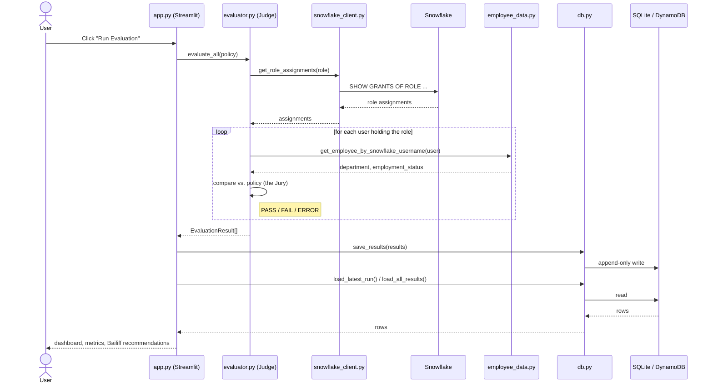

# Judge

A lightweight continuous access assurance prototype. Judge continuously
tests whether a sensitive Snowflake role still matches business policy,
instead of relying on quarterly, manually rubber-stamped access reviews.

See [`../judge-prd.md`](../judge-prd.md) for the full product spec.

**Live in production:** https://judge.spencer-sheehan.com (ECS Fargate +
ALB, DynamoDB, real Snowflake trial account — see
[`infra/README.md`](infra/README.md) for the deployed architecture).

## Call flow

What happens when someone clicks **Run Evaluation**:



If `snowflake_client.py` or `employee_data.py` can't get an answer (a
down data source, a missing employee record), that becomes `ERROR`
instead of a silent `PASS` — see the decision table below. `db.py`
picks SQLite or DynamoDB per `JUDGE_DB_BACKEND`, transparently to
everything above it.

## How it works

- **Jury** — the eligibility policies, one YAML file per role in `policies/`.
  A condition's value may be a list, meaning "any of" (e.g.
  `department: [TRUST, GRC]`); supported attributes are `employment_status`,
  `department`, and `email`. Unknown attributes fail closed.
- **Judge** — the deterministic evaluation engine (`evaluator.py`) that
  compares each user's actual attributes and Snowflake access against
  the Jury's policy.
- **Bailiff** — the remediation surface. On `FAIL`, the dashboard flags
  the user with a recommended action ("Review and revoke access"). The
  MVP never auto-revokes.

Every evaluation produces one of three outcomes:

| Decision | Meaning |
|---|---|
| `PASS` | User satisfies the policy. |
| `FAIL` | User holds the role but does not satisfy the policy. |
| `ERROR` | Judge could not reach a decision — a data source (employee or Snowflake) was unavailable or broken. **Never reported as PASS.** |

Results are persisted as an append-only audit trail: `evaluation_id`,
`user`, `role`, `decision`, `reason`, `policy_version`, `evaluated_at`.
The storage backend is selected via `JUDGE_DB_BACKEND`:

| Backend | When | Storage |
|---|---|---|
| `sqlite` (default) | Local dev, sample mode | Local file `judge.db` |
| `dynamodb` | Production | DynamoDB table (survives container restarts/redeploys, shared across instances — see `db_dynamo.py` and `infra/dynamodb.tf`) |

A container's local disk doesn't survive restarts/redeploys and isn't
shared across instances, so production always runs with
`JUDGE_DB_BACKEND=dynamodb`.

## Setup

```bash
cd judge
python3 -m venv .venv && source .venv/bin/activate
pip install -r requirements.txt
```

## Run the dashboard

```bash
streamlit run app.py
```

Click **Run Evaluation**. With the bundled synthetic data you should see:

| User | Decision | Reason |
|---|---|---|
| ALICE | PASS | Satisfies policy (Data, active) |
| BOB | FAIL | Wrong department (Marketing) |
| CHARLIE | FAIL | Employee inactive (terminated) |

(Users are identified by their Snowflake username — `employees.csv`
maps each one to email/department/status via a `snowflake_username`
column; see `employee_data.py`.)

## Run the tests

```bash
pytest tests/
```

## Snowflake modes

Judge defaults to **sample mode** — no Snowflake account required. It
reads synthetic role-grant data from
`data/snowflake_roles_sample.csv`.

To point Judge at a real Snowflake trial account instead:

```bash
pip install snowflake-connector-python
export JUDGE_MODE=live
export SNOWFLAKE_ACCOUNT=...
export SNOWFLAKE_USER=...
export SNOWFLAKE_WAREHOUSE=...
export SNOWFLAKE_ROLE=...                         # optional
export SNOWFLAKE_PRIVATE_KEY_PATH=/path/to/rsa_key.p8
streamlit run app.py
```

**Use key-pair auth (`SNOWFLAKE_PRIVATE_KEY_PATH`, or
`SNOWFLAKE_PRIVATE_KEY` for the PEM content directly — used in
production, injected from Secrets Manager), not
`SNOWFLAKE_PASSWORD`.** Password auth is a dead end for a service
account on most Snowflake accounts: Snowflake's default MFA policy
blocks non-interactive password logins outright (`SNOWFLAKE_PASSWORD`
is still supported as a fallback, but expect
`Multi-factor authentication is required for this account`). See
`snowflake_client.py` for the full precedence order and
`infra/README.md` for how the production key gets into Secrets
Manager.

In live mode, Judge runs `SHOW GRANTS OF ROLE PROD_ANALYTICS_ROLE`
against the real account. Any connection or query failure surfaces as
`ERROR`, never silently falls back to sample data — a broken pipeline
must not look like a healthy control.

## Running in Docker

```bash
docker build -t judge:local .
docker run -p 8501:8501 \
  -e JUDGE_MODE=sample -e JUDGE_DB_BACKEND=sqlite \
  judge:local
```

For the production image build/push/deploy flow, see
[`infra/README.md`](infra/README.md) (`infra/deploy.sh` handles it).

## Deployment

Production infra is Terraform-managed in [`infra/`](infra/) — ECS
Fargate behind an ALB (not App Runner: it doesn't support the
WebSocket connections Streamlit needs, see `infra/README.md` for what
that looked like and why it was replaced), DynamoDB, ECR, Secrets
Manager, and HTTPS via a Route 53 + ACM-managed custom domain. Full
architecture, deploy steps, and cost breakdown: `infra/README.md`.

## Non-goals (MVP)

See `judge-prd.md` §16. Notably: no automatic revocation, no manager
certification workflow, no general-purpose policy engine, no Workday /
ConductorOne / Slack integrations, no LLM-driven access decisions.
