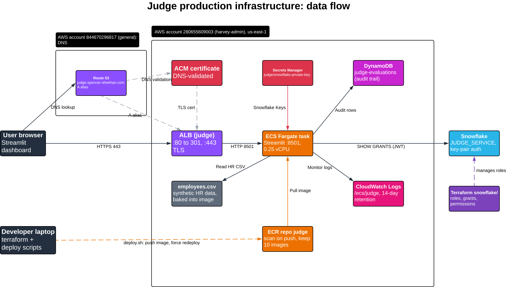

# Judge — production infrastructure

Runs Judge as an always-on container on **ECS Fargate behind an ALB**,
backed by **DynamoDB** for the audit trail and **Secrets Manager** for
the Snowflake private key. The same image also runs **once a day** as
a headless one-off task (EventBridge Scheduler), and emails an alert
via **SNS** if that run crashes or finds any FAIL/ERROR. All resources live in AWS account
`280655609003` (`harvey-admin` profile), region `us-east-1`.

> **Note on App Runner:** this originally ran on AWS App Runner, which
> is simpler to operate. It doesn't work for this app: App Runner
> doesn't support WebSocket connections, and Streamlit requires one for
> live UI updates (the page loads, then hangs indefinitely on
> "Please wait..."). ECS + ALB was the fix — ALB supports WebSockets
> natively. If a future App Runner release adds WebSocket support, this
> could move back for less operational surface; unlikely though, since
> AWS has said App Runner isn't getting new features.

```
Internet ──HTTPS──▶ ALB ──▶ ECS Fargate task (0.25 vCPU / 0.5 GB)
     │  (HTTP redirects to HTTPS)   │  pulls image from
     │                              ▼
     │                           ECR repo "judge"
     │                              │  container calls
     │                              ├──▶ DynamoDB table "judge-evaluations" (audit trail)
     │                              ├──▶ Secrets Manager "judge/snowflake-private-key"
     │                              └──▶ Snowflake (SHOW GRANTS OF ROLE, key-pair auth)
     │
     └── judge.spencer-sheehan.com (Route 53 alias → ALB, ACM cert, DNS validation)

EventBridge Scheduler (daily, 11:00 America/Los_Angeles)
     │  ecs:RunTask, command override: python run_evaluation.py
     ▼
One-off Fargate task (same task def, group "judge-daily") ──▶ DynamoDB, Secrets Manager, Snowflake
     │  STOPPED with exit code ≠ 0 (crash or any FAIL/ERROR), or failed to start
     ▼
EventBridge rule "judge-daily-run-failed" ──▶ SNS topic "judge-alerts" ──▶ email
```

Runs in the account's **default VPC**, public subnets, with the Fargate
task getting a public IP directly (no NAT gateway — that's a ~$32/mo
fixed cost this app doesn't need). A security group restricts inbound
traffic to the task to only the ALB; the ALB itself accepts inbound
HTTP (301-redirected to HTTPS) and HTTPS from the internet.

## Data flow



The diagram covers both AWS accounts, the task's startup and runtime flows,
the deploy path and the Snowflake Terraform root. It was exported from
[Lucidchart](https://lucid.app/lucidchart/43a213fd-c93a-4a36-89e6-c42cd3b799c2/view)
(link needs Lucid account access); the committed SVG is the copy to keep in
sync when the infrastructure changes. Each arrow, by its label in the diagram:

| Diagram label | Flow | What happens |
|---------------|------|--------------|
| DNS lookup | User → Route 53 | Resolves `judge.spencer-sheehan.com` (A alias → ALB; zone is in the `general` account) |
| HTTPS 443 | User → ALB | ACM cert, TLS 1.3/1.2. Port 80 only 301-redirects to HTTPS |
| HTTP 8501 | ALB → Fargate task | Plain HTTP to the task, including Streamlit's long-lived WebSocket |
| Pull image | ECR → Fargate task | At task startup, the execution role pulls the `judge` image |
| Snowflake Keys | Secrets Manager → Fargate task | At task startup, the execution role injects the Snowflake private key as `SNOWFLAKE_PRIVATE_KEY` |
| SHOW GRANTS (JWT) | Fargate task → Snowflake | `SHOW GRANTS OF ROLE` over key-pair auth as `JUDGE_SERVICE` |
| Read HR CSV | Fargate task → `employees.csv` | Reads the synthetic HR data baked into the image |
| Audit rows | Fargate task → DynamoDB | Task role writes/reads audit-trail rows in `judge-evaluations` |
| Monitor logs | Fargate task → CloudWatch Logs | Container stdout/stderr to `/ecs/judge` |
| A alias, DNS validation, TLS cert | Route 53 → ALB / ACM → ALB | One-time DNS records and the certificate the ALB serves |
| Daily RunTask | EventBridge Scheduler → Fargate task | 11:00 AM Pacific, starts a one-off task running `python run_evaluation.py` (same image, roles and flows as above, minus the ALB) |
| Task stopped (exit ≠ 0) | Fargate task → EventBridge rule | ECS emits a `Task State Change` event; the rule matches failed `judge-daily` tasks only |
| Alert | EventBridge rule → SNS → Email | SNS emails the subscribed address with the exit code, stop reason and where to look |

Out-of-band flows: `deploy.sh` pushes the image to ECR and forces a new ECS
deployment; `set_snowflake_key.sh` writes the real key into Secrets Manager;
the `snowflake/` Terraform root manages Snowflake roles and grants.

## File guide

Everything in `judge/infra/` (the AWS root module; run Terraform from here).

### Terraform resources

| File | Purpose |
|------|---------|
| `versions.tf` | Terraform/provider version pins, the default `aws` provider (`harvey-admin` profile) and the `aws.dns` alias (`general` profile) for the Route 53 records. Also documents why state is local |
| `variables.tf` | Input variables: region, app name, image tag, Fargate CPU/memory, Snowflake account/user/warehouse/role, domain name, Route 53 zone ID, daily schedule + time zone, alert email |
| `vpc.tf` | Looks up the account's default VPC/subnets (no custom VPC, no NAT) and defines the two security groups: `judge-alb` (80/443 from the internet) and `judge-fargate-service` (8501 from the ALB only) |
| `alb.tf` | Application Load Balancer, target group (port 8501, `/_stcore/health` check, 300s idle timeout for WebSockets), HTTP listener that redirects to HTTPS, and the HTTPS listener that forwards to the task |
| `dns.tf` | ACM certificate (in the app account), its DNS validation records and the `judge.spencer-sheehan.com` A alias to the ALB (both records in the domain's account via `aws.dns`) |
| `ecr.tf` | ECR repository for the Judge image (scan on push) and a lifecycle policy that keeps the 10 most recent images |
| `ecs.tf` | ECS cluster, CloudWatch log group (14-day retention), Fargate task definition (env vars, injected secret, log config) and the service (1 task, public IP, attached to the ALB target group) |
| `iam.tf` | Two roles: the **execution role** (pull image, write logs, read the Snowflake key secret at startup) and the **task role** (least-privilege DynamoDB access for the running container) |
| `dynamodb.tf` | `judge-evaluations` audit-trail table (`pk`/`sk` keys, on-demand billing, point-in-time recovery) |
| `secrets.tf` | Empty Secrets Manager secret for the Snowflake private key, with `ignore_changes` so Terraform never overwrites the real value |
| `schedule.tf` | EventBridge Scheduler schedule for the daily headless run (`judge-daily`, command override `python run_evaluation.py`) and its IAM role (`ecs:RunTask` on the Judge task def + `iam:PassRole` on the two ECS roles) |
| `alerts.tf` | SNS topic `judge-alerts` + email subscription, EventBridge rule matching a failed scheduled task, the rule → SNS target (readable message via input transformer) and the topic policy allowing only that rule to publish |
| `outputs.tf` | Values printed after `apply`: service URL, ALB DNS name, ECS cluster/service names, ECR URL, DynamoDB table name, secret ARN, daily schedule name, alerts topic ARN |

### Scripts

| File | Purpose |
|------|---------|
| `deploy.sh` | Builds the Docker image (linux/amd64), pushes it to ECR and, if the ECS service exists, forces a new deployment |
| `set_snowflake_key.sh` | Writes the real Snowflake private key from `judge/.snowflake/rsa_key.p8` into Secrets Manager, bypassing Terraform state |

### Configuration and Terraform bookkeeping

| File | Purpose | In git? |
|------|---------|---------|
| `terraform.tfvars.example` | Template for `terraform.tfvars` (Snowflake account, user, warehouse, role; nothing secret) | Yes |
| `terraform.tfvars` | Your actual variable values | No (gitignored) |
| `.terraform.lock.hcl` | Pinned provider versions and checksums | Yes |
| `.terraform/` | Downloaded providers, created by `terraform init` | No (gitignored) |
| `terraform.tfstate`, `terraform.tfstate.backup` | Local Terraform state | No (gitignored) |

### Subdirectory and docs

| Path | Purpose |
|------|---------|
| `snowflake/` | Separate Terraform root (own state) for Snowflake roles, grants and permissions. See [`snowflake/README.md`](snowflake/README.md) |
| `docs/judge-infra-data-flow.svg` | Data flow diagram embedded at the top of this README |
| `README.md` | This file |

## Cross-account DNS

`spencer-sheehan.com` is registered in a **different** AWS account
(`844670296817`, profile `general`) from where Judge itself runs
(`280655609003`, `harvey-admin`). `versions.tf` declares a second
provider alias (`aws.dns`, using the `general` profile) just for the
Route 53 records — the ACM certificate resource itself must live in
`harvey-admin` (same account+region as the ALB that uses it; ACM certs
can't be used cross-account without AWS Certificate Manager sharing via
RAM, which would be overkill here). `dns.tf` handles both: the cert is
created in `harvey-admin`, its DNS validation CNAME and the final A
record (alias to the ALB) are created via the `aws.dns` provider in the
domain's account.

If the `general` profile's credentials aren't available/valid, only
`dns.tf`'s resources fail — the ALB/ECS/DynamoDB/etc. in `harvey-admin`
apply independently of it.

## First-time setup

```bash
cd judge/infra
cp terraform.tfvars.example terraform.tfvars   # fill in your Snowflake account/warehouse
terraform init
```

**Phase 1 — create just the ECR repo** (the ECS task definition needs an
image to already exist before the service can start):

```bash
terraform apply -target=aws_ecr_repository.judge
```

**Push the first image:**

```bash
../deploy.sh
```

**Phase 2 — everything else** (ECS cluster/service, ALB, DynamoDB, IAM,
Secrets Manager, networking):

```bash
terraform apply
```

**Populate the real Snowflake private key** (this is intentionally a
separate, non-Terraform step — see the comment in `secrets.tf` for why):

```bash
./set_snowflake_key.sh
```

The task definition resolves Secrets Manager values at container
*startup*, not continuously, so force a fresh deployment after setting
the key for the first time:

```bash
command aws ecs update-service --profile harvey-admin --region us-east-1 \
  --cluster judge --service judge --force-new-deployment
```

**Confirm the alert email subscription.** `terraform apply` sends an
"AWS Notification - Subscription Confirmation" email to `alert_email`;
click the link in it. Until then SNS silently drops alerts (the
subscription shows as `PendingConfirmation`).

## Daily scheduled run and alerts

`schedule.tf` runs the evaluation every day at 11:00 AM Pacific
(`schedule_expression` / `schedule_timezone`) as a one-off Fargate task
from the dashboard's task definition, with the command overridden to
`python run_evaluation.py` (the Dockerfile uses `CMD` rather than
`ENTRYPOINT` so this override works). The script saves results to the
same DynamoDB audit trail (they appear under Audit History in the
dashboard) and its exit code says what happened; the alert email
includes it:

| Exit code | Meaning |
|-----------|---------|
| 0 | All PASS, no email |
| 1 | The run crashed (uncaught exception, e.g. DynamoDB unreachable or a bad policy file) |
| 2 | At least one `ERROR`: a data source was broken (takes precedence over FAIL) |
| 3 | At least one `FAIL`: someone holds access the policy doesn't allow |
| 4 | Zero users evaluated: an empty grant list can hide a broken pipeline |

An unresolved FAIL emails again every day until the access is revoked (intended).

`alerts.tf` turns that exit code into an email: an EventBridge rule
matches `ECS Task State Change` events for `STOPPED` tasks in group
`judge-daily` with a non-zero exit code (or `TaskFailedToStart`) and
publishes to the `judge-alerts` SNS topic. The email says what happened;
the per-user details are in the task's log stream in `/ecs/judge`.

Run it on demand (same thing the schedule does, including the alert):

```bash
SUBNETS=$(command aws ec2 describe-subnets --profile harvey-admin --region us-east-1 \
  --filters Name=default-for-az,Values=true --query 'Subnets[].SubnetId' --output text | tr '\t' ,)
SG=$(command aws ec2 describe-security-groups --profile harvey-admin --region us-east-1 \
  --filters Name=group-name,Values=judge-fargate-service --query 'SecurityGroups[0].GroupId' --output text)
command aws ecs run-task --profile harvey-admin --region us-east-1 \
  --cluster judge --task-definition judge --launch-type FARGATE --group judge-daily \
  --network-configuration "awsvpcConfiguration={subnets=[$SUBNETS],securityGroups=[$SG],assignPublicIp=ENABLED}" \
  --overrides '{"containerOverrides":[{"name":"judge","command":["python","run_evaluation.py"]}]}'
```

## Snowflake roles and permissions

Snowflake roles, user grants and least-privilege permissions are managed by a
separate Terraform root module in [`snowflake/`](snowflake/README.md) (own
state, key-pair auth as `TERRAFORM_SERVICE`). It is independent of everything
above.

## Subsequent deploys

Code change → rebuild → push → force a new ECS deployment (`deploy.sh`
does both automatically once the service exists):

```bash
../deploy.sh
```

Watch rollout status:

```bash
command aws ecs describe-services --profile harvey-admin --region us-east-1 \
  --cluster judge --service judge --query 'services[0].deployments'
```

Infra change (new env var, more memory, etc.) → edit the `.tf` files →:

```bash
terraform plan
terraform apply
```

## Secrets handling

- The Snowflake private key is **never** referenced by a Terraform
  variable or resource value — only an empty placeholder secret is
  created by Terraform (`secrets.tf`), with `lifecycle.ignore_changes`
  so `apply` can never overwrite the real value.
- The real value is set via `set_snowflake_key.sh`, which calls
  `aws secretsmanager put-secret-value` directly — the key touches AWS
  and your local `.snowflake/` directory only, never Terraform state.
- The ECS task definition's `secrets` block injects it as the
  `SNOWFLAKE_PRIVATE_KEY` env var at container start (the execution
  role, not the task role, needs `secretsmanager:GetSecretValue` for
  this — the ECS agent resolves it before the container ever runs, no
  application code calls Secrets Manager directly).
- `terraform.tfstate` is gitignored regardless, as defence in depth.

## Cost (rough, at minimal/idle scale)

- ALB: ~$16–20/mo (fixed hourly charge — this is the main cost driver
  and the main trade-off versus App Runner)
- Fargate: ~$5–10/mo (0.25 vCPU / 0.5 GB, one task)
- DynamoDB: pennies/mo (PAY_PER_REQUEST, this app's volume is tiny)
- ECR: pennies/mo (image storage, lifecycle policy caps at 10 images)
- Secrets Manager: ~$0.40/mo per secret
- Daily scheduled run: EventBridge Scheduler and SNS email are within
  the free tier at one run/day; the one-off Fargate task adds about a
  minute of 0.25 vCPU per day (well under $0.10/mo)
- NAT gateway: $0 (deliberately avoided — see vpc.tf)
- ACM certificate: $0 (public certs are free)
- Route 53: pennies/mo (a few DNS queries; the hosted zone itself is
  billed to the `general` account regardless of this app)

## Tearing down

```bash
terraform destroy
```

This does **not** delete anything in Snowflake (the `JUDGE_SERVICE`
user, role grants, etc.) — that's managed separately in Snowsight.
